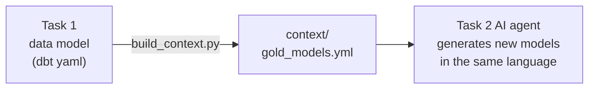

# JFrog Artifactory — Data Engineering Assignment

This repo is my solution to the JFrog take-home. It has two tasks in one place:

- **[`task1_gold_model/`](./task1_gold_model)** — a Gold-layer analytics data model
  for the Artifactory domain, built straight from raw Redshift tables.
- **[`task2_ai_pipeline/`](./task2_ai_pipeline)** — a semi-automated pipeline that
  turns an analyst's plain-language request into a dbt model draft (SQL + YAML),
  auto-reviewed and ready for a pull request.

New here? Start with **[`GUIDE.md`](./GUIDE.md)** — a plain-English walkthrough of
the whole repo and how I built it.

## Repo map

```
jfrog-artifactory-analytics/
├── README.md              you are here
├── GUIDE.md               plain-English walkthrough + how I built it
├── task1_gold_model/      TASK 1 — the data model
│   ├── docs/              model definitions, ERD, assumptions
│   └── models/gold/       fct_download_events.sql (+ .yml) and the dbt schema
└── task2_ai_pipeline/     TASK 2 — the AI pipeline
    ├── agents/            prompts for the generator and reviewer
    ├── context/           the "contract" fed to the AI (built from Task 1)
    ├── scripts/           the working pipeline, reviewer, context builder, web form
    ├── examples/          a sample request and generated output
    └── tests/             unit tests for the reviewer
```

## How the two tasks connect

This is the core idea: **Task 1 is the ground truth that Task 2 feeds on.**



The data model's schema, naming rules and constraints live in
`task2_ai_pipeline/context/`. The AI reads exactly those files, so every model it
generates follows the same conventions and only references columns that really
exist. The model catalog (`gold_models.yml`) is **generated** from the Task 1 dbt
schema, so the two never drift apart.

## Run it (Task 2)

```bash
cd task2_ai_pipeline
pip install -r requirements.txt
python scripts/generate_model.py --request examples/request.txt --out examples/ --dry-run
python -m pytest tests -q
```

No API key needed for `--dry-run`. For live generation set `GEMINI_API_KEY` or
`ANTHROPIC_API_KEY`. Full details in
[`task2_ai_pipeline/README.md`](./task2_ai_pipeline/README.md).
