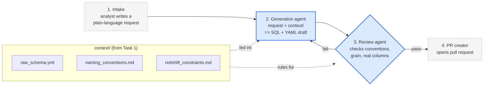

# Task 2 - AI-Assisted Transformation Pipeline

Turn an analyst's plain-language request into a reviewed DBT model draft (SQL +
YAML), so analysts can propose new Gold models without a data engineer in the loop
for every request.

## Workflow



Blue = built end-to-end in this assignment. Grey/dashed = stubbed.
The generation agent **calls the review agent programmatically**; if review fails,
the feedback goes back to generation for one retry.

## Repo layout

```
task2_ai_pipeline/
├── README.md            <- this file
├── agents/
│   ├── generator.md      <- prompt for the generation agent
│   └── reviewer.md       <- prompt for the review agent
├── context/             <- the contract, encoding Task 1 (injected into prompts)
│   ├── raw_schema.yml
│   ├── naming_conventions.md
│   └── redshift_constraints.md
├── scripts/
│   ├── generate_model.py <- the working pipeline (generation -> review)
│   ├── reviewer.py        <- deterministic review checks (the testable core)
│   └── app.py             <- intake as a tiny Flask web form
├── examples/
│   ├── request.txt       <- sample analyst request (intake stub)
│   ├── output.sql        <- generated model
│   └── output.yml        <- generated tests/docs
└── tests/
    └── test_reviewer.py  <- unit tests for the review agent's checks
```

## Run it

Install once:

```bash
cd task2_ai_pipeline
pip install -r requirements.txt
```

**No API key?** The pipeline runs in dry-run mode and returns a sample model, so
you can try the whole flow (including the review step) offline.

**For real generation**, set one key. Gemini (has a free tier) is the default:

```bash
export GEMINI_API_KEY=...        # uses Gemini  (default if set)
# or, instead:
export ANTHROPIC_API_KEY=...     # uses Claude
```

The pipeline picks Gemini if its key is set, otherwise Claude. To change the model:
`export GEMINI_MODEL=gemini-2.5-pro` (or `ANTHROPIC_MODEL=...`).

Then run it one of two ways — the command line, or the web form:

```bash
python scripts/generate_model.py --request examples/request.txt --out examples/
python scripts/app.py            # web form at http://127.0.0.1:5000
```

## What is built vs stubbed

| Stage | State | Where |
|---|---|---|
| 1. Intake | **built (light)** - CLI file or a Flask web form | `examples/request.txt`, `scripts/app.py` |
| 2. Generation agent | **built** | `agents/generator.md`, `scripts/generate_model.py` |
| 3. Review agent | **built** (deterministic checks + LLM judgment) | `agents/reviewer.md`, `scripts/reviewer.py` |
| 4. PR creator | stub - prints what it would do | end of `generate_model.py` |

The generation agent calls the review agent in-process; on a FAIL it feeds the
issues back and retries once. Eight unit tests cover the review checks
(`tests/test_reviewer.py`).

## How we guard against garbage

- **Hallucinated columns** - the reviewer parses every `unstruct_event.<field>` and
  every `source()` table and rejects anything not in `raw_schema.yml`. This is the
  riskiest failure for a SUPER-heavy schema, so it is checked mechanically, not
  left to the LLM.
- **Ambiguous requests** - the generator is told to return a `CLARIFY:` question
  instead of guessing the grain or scope; the pipeline surfaces the question and
  stops rather than producing a wrong model silently.
- **Convention drift** - naming, grain declaration, config hints, and grain tests
  are all enforced before a model can pass.

## Limitations & next steps

- **Column validation is partial.** We verify SUPER payload fields and source
  tables, but not every column in every CTE against the full lineage. Next step:
  build a proper column-graph from `raw_schema.yml` + `ref()` targets and validate
  all references.
- **The LLM reviewer is advisory.** Only the deterministic checks block a model.
  Next step: have the LLM reviewer return structured issues and merge them with the
  mechanical ones under a single policy.
- **Single retry.** On repeated failure the pipeline gives up. Next step: cap by
  cost/iterations and attach the failing diff to the PR for a human.
- **Stubbed intake and PR.** Next step: a small web form or Slack command for
  intake, and a real GitHub PR via the API with the review report as the PR body.
- **No execution / no `dbt build`.** We generate and review but do not run the
  model. Next step: compile against a dev schema and run dbt tests in CI before the
  PR is allowed to merge.
- **dbt_utils dependency.** Composite-grain tests assume `dbt_utils` is installed.
